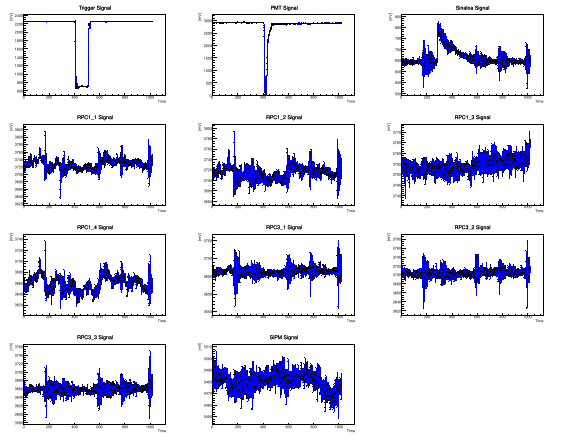
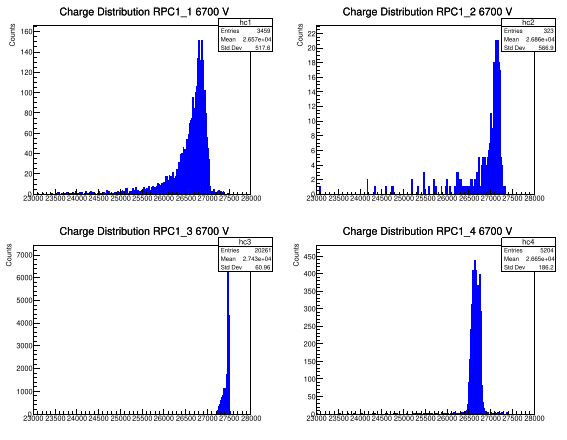
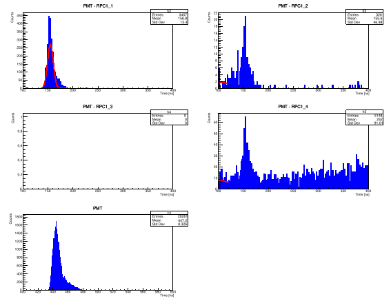
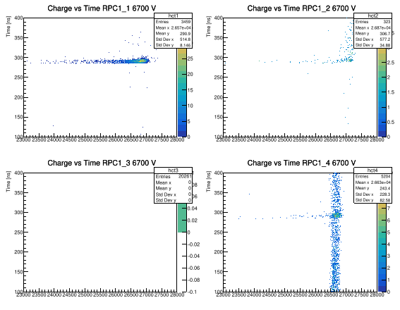

# RPC Beam Test Data Analysis

This project provides tools for analyzing beam test data from a multi-detector setup that includes Resistive Plate Chambers (RPCs), Silicon Photomultipliers (SiPMs), and Photomultiplier Tubes (PMTs). It was developed in the context of detector performance studies for the ALICE3 experiment at CERN.

## Purpose

The main script, `readData.C`, reads binary waveform data acquired with a CAEN digitizer and performs the following tasks:

- Computes charge distributions for each detector
- Calculates detection efficiency for individual RPC pads
- Measures time resolution between RPCs and a PMT reference signal
- Creates visual plots of signals, charge distributions, and charge vs. time
- Outputs numerical results into a plain text file

## 📁 Directory Structure

```text
RPC_BeamTest_Analysis/
├── readData.C
├── Functions_BeamTest.h
├── 6GeVHadrons_16102024_12/
│   ├── TR_0_0.dat
│   ├── wave_0.dat
│   ├── wave_1.dat
│   ├── ...
│   └── wave_16.dat
├── Efficiency&TR.txt
├── Signals.svg
├── TimeResolutionRPC1.svg
├── TimeResolutionRPC3.svg
├── ChargeRPC1.svg
├── ChargeRPC3.svg
├── ChargevsTimeRPC1.svg
└── ChargevsTimeRPC3.svg
```


## ⚙️ Requirements

- ROOT (v6 or higher) [https://root.cern](https://root.cern/)
- Binary waveform files from a CAEN digitizer (16+1 channels)
- Header file: `Functions_BeamTest.h` with required external definitions like `SIZE_SAMPLE`

## 🚀 How to Run

1. Ensure your waveform data is stored in the expected folder and filenames are correct.
2. Launch a ROOT session and execute:
   ```cpp
   .L readData.C
   readData()

3. Review the generated output files and plots.

Output Files
Efficiency&TR.txt — contains numerical results including:

Total events

Coincidences

Detection efficiency for each RPC

Time resolution per detector

.svg plots:

Signals.svg: raw waveform for each channel

TimeResolutionRPC[1,3].svg: time differences between PMT and RPCs

ChargeRPC[1,3].svg: charge distribution per RPC

ChargevsTimeRPC[1,3].svg: 2D histograms of charge vs. signal time

## 📈 Example Plots

### Signal Overview



### Charge Distribution – RPC1



### Time Resolution – RPC1



### Charge vs Time – RPC1



### Notes
Time and charge thresholds are hard-coded for each channel; adjust them based on setup.

The waveform amplitude is converted using AmplitudeResolution = 0.24414 mV/bit.

Sampling rate is assumed to be 1 GS/s.

## Context
This code is part of a data analysis effort for beam tests involving custom-built glass RPCs at the Benemérita Universidad Autónoma de Puebla (BUAP) and tested at CERN’s T10 beamline.

## 👨‍🔬 Author
Héctor David Regules Medel 
[https://github.com/rhectord](https://github.com/rhectord)

## 📄 License
MIT License — feel free to use, modify, and share with credit.

